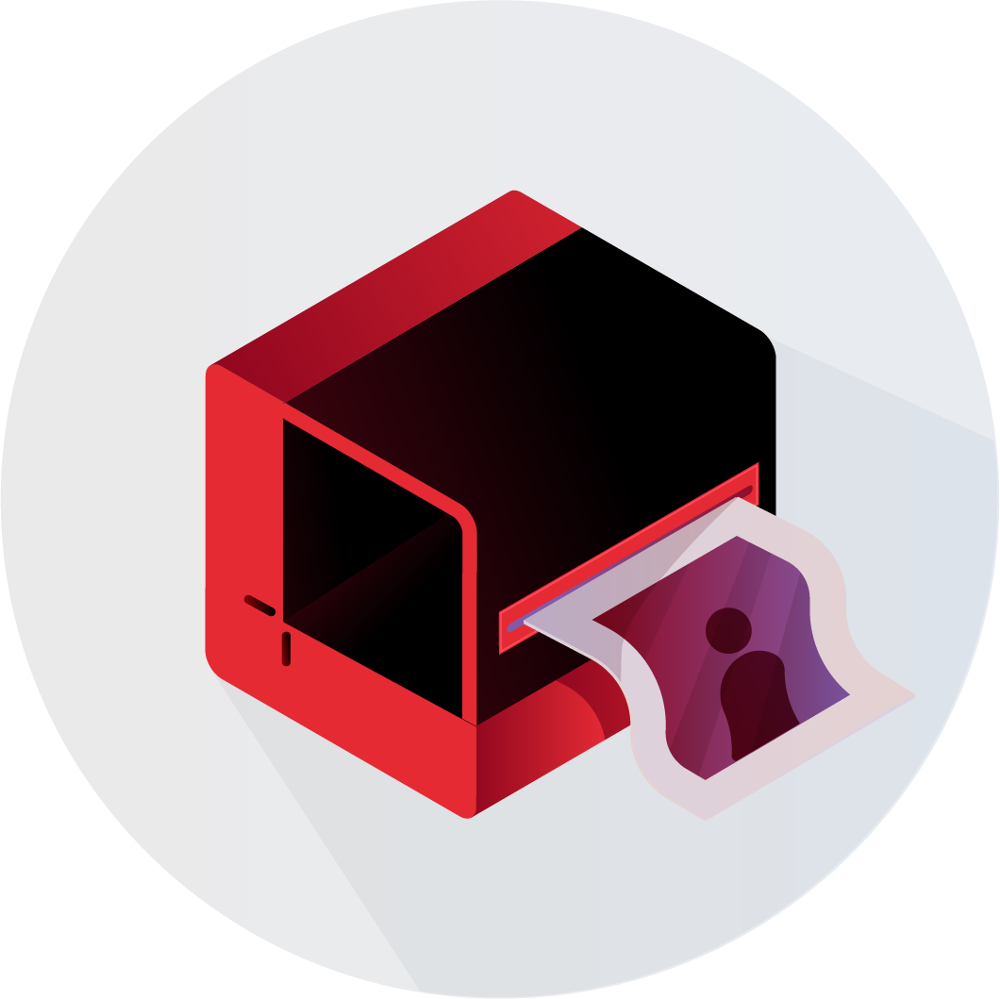
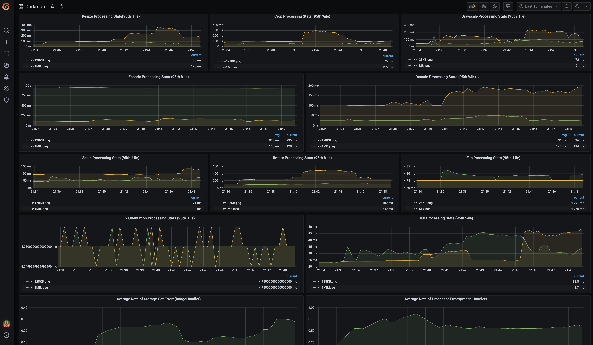

# Darkroom - Yet Another Image Proxy

<p align="center"></p>

[](https://travis-ci.com/gojek/darkroom)
[](https://coveralls.io/github/gojek/darkroom?branch=master)
[](https://gojek.github.io/darkroom/)
[](https://godoc.org/github.com/gojek/darkroom)
[](https://goreportcard.com/report/github.com/gojek/darkroom)
[](https://golangci.com)
[](https://github.com/gojek/darkroom/releases)
[](https://github.com/avelino/awesome-go)  

## Introduction

[Darkroom](https://gojek.github.io/darkroom/) combines the [storage backend](pkg/storage) and the [image processor](pkg/processor) and acts as an `Image Proxy` on your image source.  
You may [implement](https://gojek.github.io/darkroom/docs/customization#custom-storage-example) your own `Storage` and `Processor` interfaces to gain custom functionality while still keeping other Darkroom Server functionality.  
The native implementations focus on speed and resiliency.

## Features

Darkroom supports several image operations which are documented [here](https://gojek.github.io/darkroom/docs/usage/size).

## Installation

```bash
go get -u github.com/gojek/darkroom ##TEST BY CSOC@GOJEK.COM##
```
Other ways to run can be found [here](https://gojek.github.io/darkroom/docs/getting-started#running-the-image-proxy-service).

## Metrics Support

Darkroom supports Prometheus and StatsD for tracking and monitoring metrics.
You need to specify the metrics system by adding an environment variable, `METRICS_SYSTEM=prometheus/statsd`
### Prometheus
The application exposes the metrics at "http://<application_url>/metrics" endpoint. Since it's a pull based system, Prometheus server that is set up from docker-compose scrapes metrics from the application endpoint and its configuration can be changed in prometheus.yml. 
### StatsD
In order to use StatsD as your metrics system, you also need to add the following env variables, 
```
METRICS_STATSD_STATSDADDR=hostname:port
METRICS_STATSD_PREFIX=client-prefix
METRICS_STATSD_SAMPLERATE=sample-rate
METRICS_STATSD_FLUSHBYTES=flushbytes
```
These are used to set up the StatsD client.
### Grafana
Darkroom currently supports grafana provisioning for Prometheus based metrics.

Grafana is preconfigured with dashboards and Prometheus as the default data source:

* Name: Prometheus
* Type: Prometheus
* Url: http://prometheus:9090
* Access: proxy

Visualization of Darkroom metrics(prometheus) on Grafana:

<p align="center"></p>

### Contributing Guide

Read our [contributing guide](./CONTRIBUTING.md) to learn about our development process, how to propose bugfixes and improvements, and how to build and test your changes to Darkroom.

## License

Darkroom is [MIT licensed](./LICENSE).
